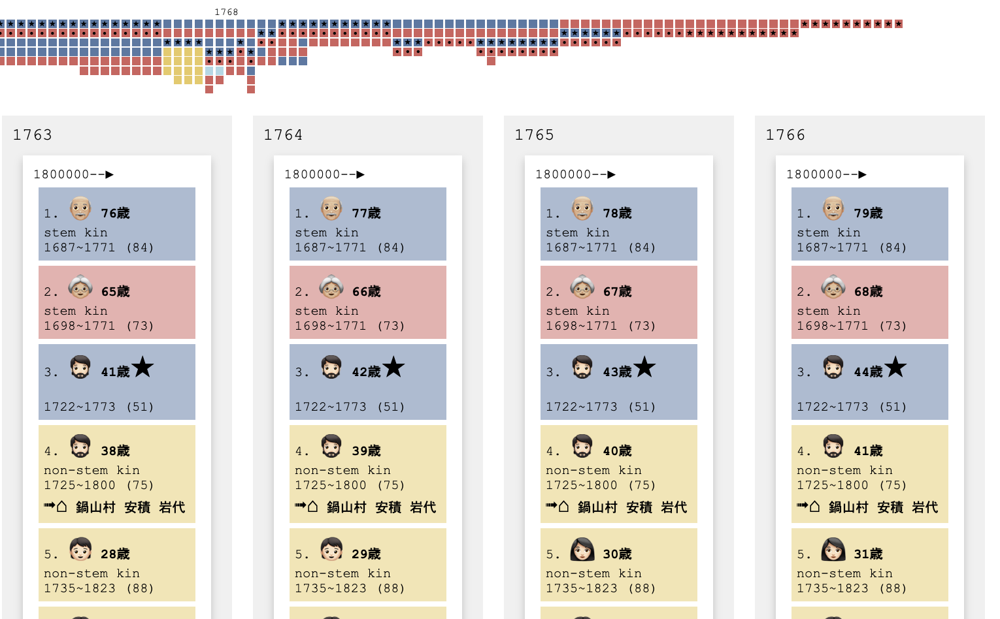
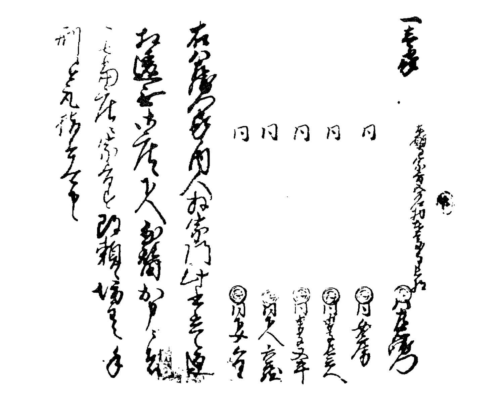
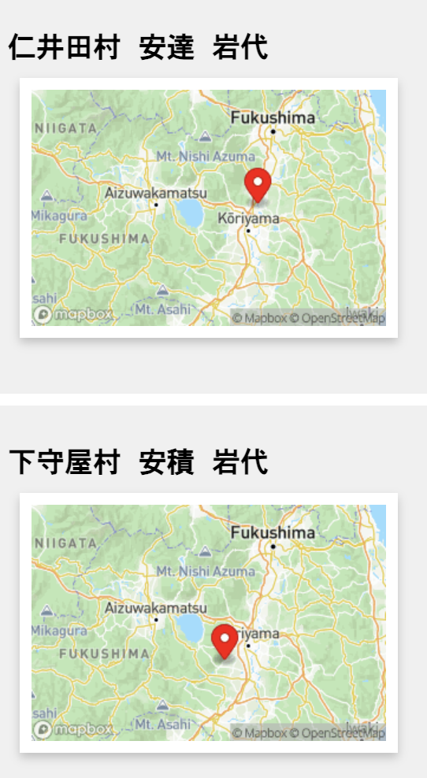
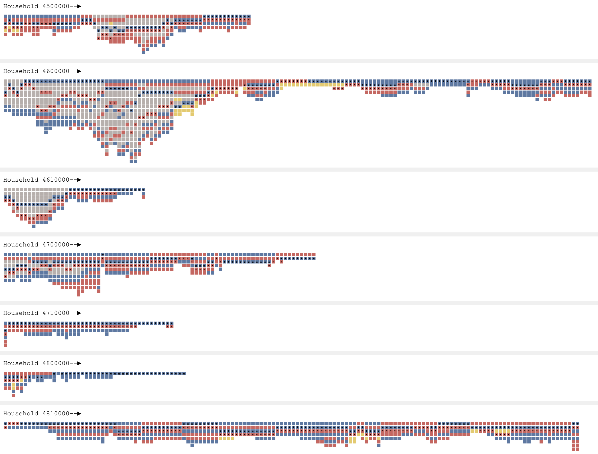
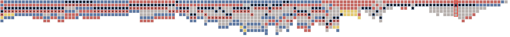
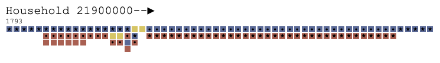
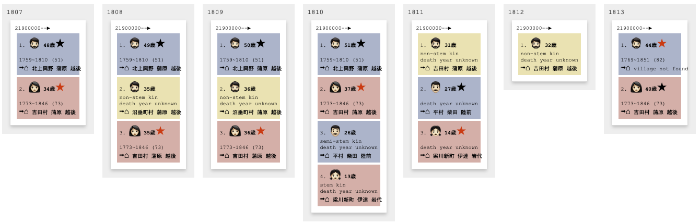

# Villages, families, and egos in the Edo Period

)

→ [https://yohman.github.io/pfhp/households.html](https://yohman.github.io/pfhp/households.html)

What did a household look like for common people in early modern Japan? Were there multiple generations living under one roof? Who would assume the role of household head, how often did people from outside their village come to live with them, and how many servants did each household have?

These questions, and many more, are revealed through the **visualization** of a rare digital collection of *Shumon-aratame-cho (SAC)* and *Ninbetsu-aratame-cho (NAC)*, which are the two major sources for the research of historical demography in Japan. The longitudinal and comparative approach applied to the records of thousands of lives of people will allow us to gain new understanding of our history and the resilience of people to socioeconomic and environmental changes.

## It's not what it looks like: The origins of the data named "Shumon-aratame-cho"

↑ An example of the original document shows a page from Niremata Village, Mino Province, 1638 (Cornell, Hayashi, 1986)

The first modern national census in Japan was conducted in 1920. Despite its rich history, there has been no systematic or sustained population data intake prior to 1920. In spite of this, there was a comprehensive population registry conducted and established by the Tokugawa government during the 17th century. It was an unusual set of circumstances that led to the creation of this registry, which was by no account originally meant to be used as a census. Its origins were rather inauspicious and haunting, with a singular purpose: to abolish Christianity from Japan, which at the time, was deemed to pose a threat to the rulers intent on national unification. 

「宗門」(shumon)　→　religious investigation 
「改帳」(aratamecho)　→　registry

While the original intent of these documents was to abolish Christianity, it is uncertain as to whether or not it served to fulfill its purpose. Moreover, with little effort to centralize and/or standardize the collection process, the documents were deemed to have little value. The decentralized nature of the documents inevitably led to many documents being thrown away or lost entirely over the years. What did survive—and a good portion managed to do so—have become a treasure-trove for historical demographers, allowing for an unprecedented view into population statistics in early modern Japan.

## "Big data" for two villages, from 1716 to 1869

Of the surviving documents, two villages stand out as having the most complete set of annual coverage. Located in Fukushima Prefecture, Niita Village and Shimomoriya village's combined registry data consists of 118,879 total records. The dataset, meticulously curated by historians (a painstaking process of converting paper notes into digital data), boasts 61 columns, amassing a total of 7.2 million data points.

### Missing data
As "complete" as the data may be, it is not without gaps. The following table illustrates where data is lacking for each village.

| Village    | Years Range | Missing Years                               |
|------------|-------------|---------------------------------------------|
| Shimomoriya| 1716-1869   | 1720, 1729, 1846, 1850, 1858, 1864-1867    |
| Niita      | 1720-1870   | 1742, 1758, 1796, 1857, 1858                |

### Descriptive statistics

| Village | Total Records | Total Households | Total Individuals | Average Household Size | Largest Household |
|---------|---------------|------------------|-------------------|------------------------|--|
| Niita   |        68,682       |340|3,875|4.24|[33](https://yohman.github.io/pfhp/households.html?vil_id=5010130&hhid=6330000)|
| Shimomoriya |      50,197     |207|2,382|4.46|[23](https://yohman.github.io/pfhp/households.html?vil_id=5040310&hhid=4600000)|

## Mini-timelines

This prototype attempts to visualize family history in modalities that the general public can relate to. By distilling big data in generically meaningful segments such as "villages," "households," and "family roles," the historical registry comes to life, revealing interactive family lineages as never seen before. 

A macro view of the family histories can be visualized through a series of "mini" timelines. A village will consist of numerous timelines, with each representing a household's entire recorded history. This more than likely results in timelines that span multiple generations, but what makes these graphics compelling is that you can determine the relative size, wealth, and longevity of each household. Here is an example of eight households in the Shimomoriya village. Notice the differences in sizes and shapes, visual temporal snapshots that demonstrate diverse familial circumstances within a single village. Some families have lineages that span the entire timeframe (households #460 and 481), while others occupy a shortened segment (households #450,#461,#470,#471,#480).

Take for example [household #1 from Shimomoriya Village](https://yohman.github.io/pfhp/households.html?vil_id=5040310&hhid=100000). In this timeline, recorded history begins in 1716 and ends in 1863, a span of 147 years.

Gender is presented in blue and red squares, households heads with a star, and spouses of household heads with a black dot. Servants (gray squares), are present throughout, indicative of the prolonged wealth of the family. The non-stem kins (in yellow) indicate the occasional presence of uncles/aunts, nephews/nieces, and cousins in the household.

Consider the following mini-timeline ([household # 219 in Niita Village)](https://yohman.github.io/pfhp/households.html?vil_id=5010130&hhid=21900000):

Here, one witnesses a relatively short family history, from 1793 to 1851. The male household head (indicated by the blue box with a star), marries and has a child (1799) who dies after just six years. Three years after the death of their daughter (1808)—perhaps to help deal with tragedy—the household is joined by a "non stem kin," likely a sibling of either the husband or wife. The father, however, dies three years later in 1810, as illustrated below:

What happens next is entirely up to speculation, but one may presume that the household is joined by relatives (including a 13 year old niece). At the same time, the wife of the deceased husband is absent for two years, taking a leave to deal with the death of her husband, only to come back in 1813 assuming the role as the new household head. But she does not return alone, instead, she now has a new husband with her, and together, they live until their respective deaths many years later, without having any children.

This, and many more narratives are available to witness via this interactive web platform. In doing so, we discover patterns previously not seen through tabular or other forms of data analysis, as the visual narratives convey the human story in an immersive manner.

## Acknowledgements

This project is being developed at the [Population and Family History Center](https://www.pfhp-japan.info/) at [Reitaku University](https://www.reitaku-u.ac.jp/), Japan.