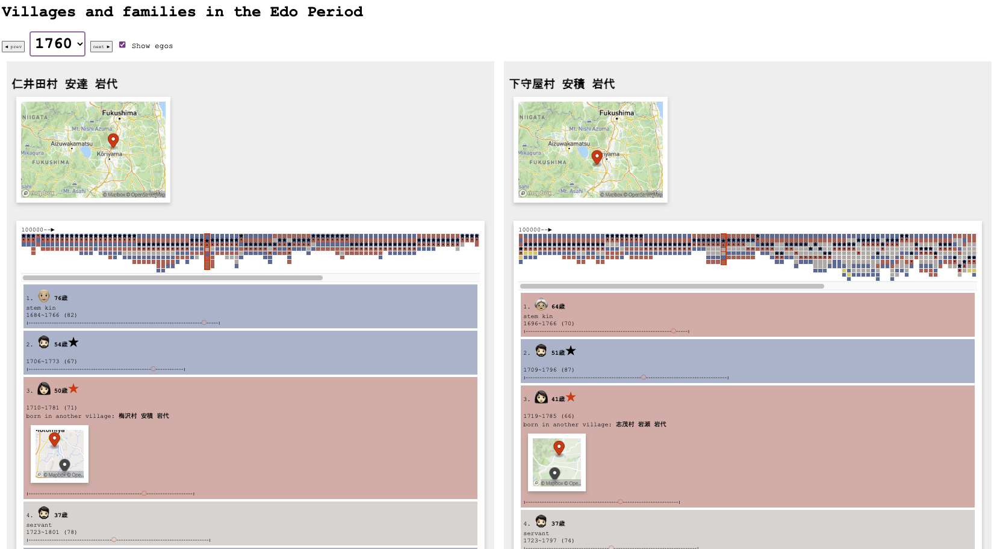

# Villages, families, and egos in the Edo Period

→ [https://yohman.github.io/pfhp/households.html](https://yohman.github.io/pfhp/households.html)

What did a household look like for common people in early modern Japan? Were there multiple generations living under one roof? Who would assume the role of household head, and how often did people from outside their village come to live with them?

These questions, and many more, are revealed through the **visualization** of a rare digital collection of *Shumon-aratame-cho (SAC)* and *Ninbetsu-aratame-cho (NAC)*, which are the two major sources for the research of historical demography in Japan. The longitudinal and comparative approach applied to the records of thousands of lives of people will allow us to gain new understanding of our history and the resilience of people to socioeconomic and environmental changes.

## The origins of the data named "Shumon-aratame-cho"
The first modern national census in Japan was conducted in 1920. Despite its rich history, there has been no systematic and sustained population data intake prior to 1920. That being said, the most comprehensive population registry was established by the Tokugawa government during the 17th century. It was conducted not to collect population data per-se, but rather to abolish Christianity, which was deemed to pose a threat to Japan's rulers intent on national unification. "Shumon" 宗門 which means religious investigation, and "aratamecho" 改帳 which means registry, was a policy put into action to 

## Visualizing family histories

This prototype attempts to visualize family history in modalities that the general public can relate to. By distilling big data in generically meaningful segements such as "villages," "households," and "family roles," the data comes to life, revealing family lineages as never seen before. Take for example the following seven year span from 1724 to 1731 of a household in 下守屋村 安積 岩代:

In the above timeline, you witness a happy family of three, only to have the father die at a youthful age of 29, then for the wife to immediately find and welcome another (younger!) partner from another village into the same household. Three years later, another child is born, only to have that child die within a year... Two years later, another child is born, but the data reveals that this second child will only live to be five years old.

At the core of this complex web of inter-related nodes is the ego itself, which is represented as a series of "ego cards."

In this example, the household has five members spanning three generations, all living under a single roof, a typical housing condition in early modern Japan. The grandparents will live well into their 70's, the head of the household, now 39 years old, married a woman from outside his village, but we know that they would both die before they reach 70. Their only daughter, who is 6 years old, will unfortunately only live to be 11 years old.

## Mini-timelines

A more macro view of the family histories can be visualized through the "mini" timelines. In these representations, entire family histories are revealed in a single graphic. Take for example [household #1 from Shimomuraya Village](https://yohman.github.io/pfhp/households.html?vil_id=5040310&hhid=100000). In this timeline, recorded history begins in 1716 and ends in 1863, a span of 147 years.

Gender is presented in blue and red squares, households heads with a star, and spouses of household heads with a black dot. Servants (gray squares), are present throughout, indicative of the prolongued wealth of the family. The non-stem kins (in yellow) indicate the occasional presence of uncles/aunts, nephews/nieces, and cousins in the household.

Consider the following mini-timeline ([household # 219 in Niita Village)](https://yohman.github.io/pfhp/households.html?vil_id=5010130&hhid=21900000):

Here, one witnesses a relatively short family history, from 1793 to 1851. The male household head (indicated by the blue box with a star), marries and has a child (1799) who dies after just six years. The father dies six years later, and the household head is transferred to the wife (notice the transition of the star from the blue square to the red). In the same year, she remarries, and lives with her second husband until their deaths.

This, and many more narratives are available to witness via this interactive web platform. In doing so, we discover patterns previously not seen through tabular or other forms of data analysis, as the visual narratives convey the human story in an immersive manner.

## Acknowledgements

This project is being developed at the [Population and Family History Center](https://www.pfhp-japan.info/) at [Reitaku University](https://www.reitaku-u.ac.jp/), Japan.