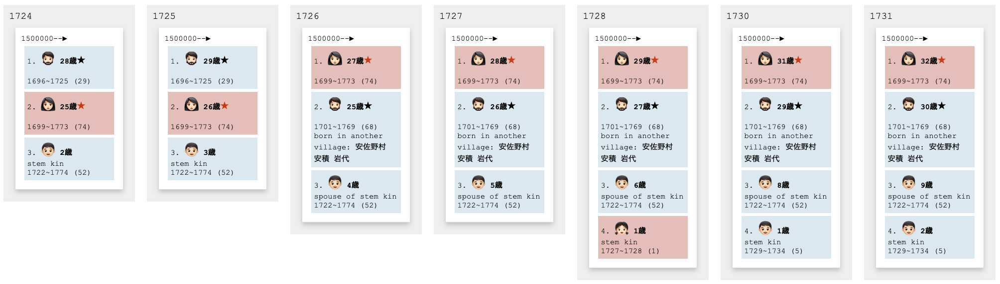
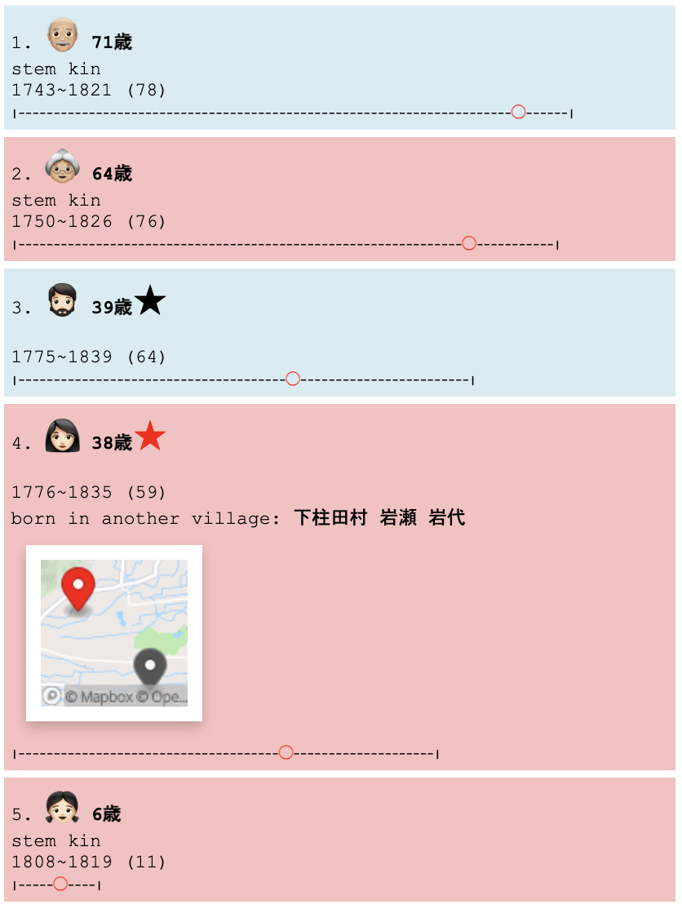
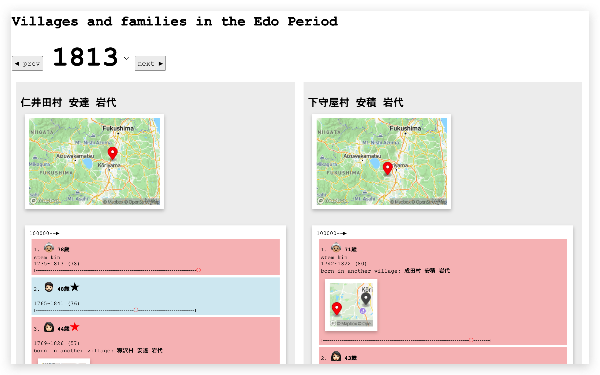

# Villages, families, and egos in the Edo Period

What did a household look like for common people in early modern Japan? Were there multiple generations living under one roof? Who would assume the role of household head, and how often did people from outside their village come to live with them?

These questions, and many more, are revealed through the **visualization** of a rare digital collection of *Shumon-aratame-cho (SAC)* and *Ninbetsu-aratame-cho (NAC)*, which are the two major sources for the research of historical demography in Japan. The longitudinal and comparative approach applied to the records of thousands of lives of people will allow us to gain new understanding of our history and the resilience of people to socioeconomic and environmental changes.

## Visualizing family histories

This prototype attempts to visualize family history in modalities that the general public can relate to. By distilling big data in generically meaningful segements such as "villages," "households," and "family roles," the data comes to life, revealing family lineages as never seen before. Take for example the following seven year span from 1724 to 1731 of a household in 下守屋村 安積 岩代:

In the above timeline, you witness a happy family of three, only to have the father die at a youthful age of 29, then for the wife to immediately find and welcome another (younger!) partner from another village into the same household. Three years later, another child is born, only to have that child die within a year... Two years later, another child is born, but the data reveals that this second child will only live to be five years old.

At the core of this complex web of inter-related nodes is the ego itself, which is represented as a series of "ego cards."

In this example, the household has five members spanning three generations, all living under a single roof, a typical housing condition in early modern Japan. The grandparents will live well into their 70's, the head of the household, now 39 years old, married a woman from outside his village, but we know that they would both die before they reach 70. Their only daughter, who is 6 years old, will unfortunately only live to be 11 years old.

This, and many, many more narratives, are available to witness via this interactive web platform.

[https://yohman.github.io/pfhp/households.html](https://yohman.github.io/pfhp/households.html)

