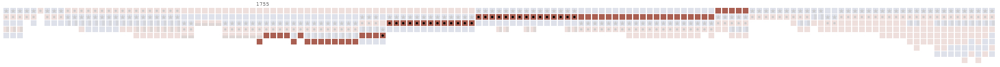

---
hide:
#   - navigation
#   - toc
# custom_template: fullwidth.html
# template: fullwidth.html
---

→ [Go to XaViz](../../)

What did a household look like for common people in early modern Japan? Were there multiple generations living under one roof? Who assumes the role of household head, how often did people from outside their village come to live with them, and how many servants did each household have?

These questions, and many more, are revealed through **XaViz**, a visualization of a rare digital collection of *Shumon-aratame-cho (SAC)* and *Ninbetsu-aratame-cho (NAC)*, which are the two major sources for the research of historical demography in Japan. XaViz is an interactive visualization tool for longitudinal and comparative inspection, applied to the records of thousands of lives of people. Its intuitive interface will allow us to gain new insights on our history and the resilience of people to socioeconomic and environmental changes.

<!-- ## The family tree

Who are we? The quest to know who we are through our lived histories and those before us through blood relationships has long been a source of intrigue. While modern DNA based analysis has conjured up ideological services such as ancestry.com, the effective visualization of archival written records has been a conundrum that has baffled genealogy studies for quite some time. Genealogy visualizations are centered around the concept of a family tree, prioritizing a single stem—usually represented by an individual and their spouses—and the relationships that are weaved from that genealogical root (Borges, 2019). Such visual approaches begin with an ego, and traverse it's lineage through time. 

We take a different approach by prioritizing the household above the individual. In fact, we consider the village as the top level hierarchy, followed by the household, and then the ego. Doing so adds a spatial dimension allowing us to visualize in/out family migration patterns, compare household structures between and within villages, all through interactive visual representations.

*TBD (Literature review)* -->

## It's not what it looks like: The origins of the data named "Shumon-aratame-cho"

↑ An example of the original document shows a page from Niremata Village, Mino Province, 1638 (Cornell & Hayami, 1986)

The first modern national census in Japan was conducted in 1920. Despite its rich history, there has been no systematic or sustained population data intake prior to 1920. In spite of this, there was a comprehensive population registry conducted and established by the Tokugawa government during the 17th century. It was an unusual set of circumstances that led to the creation of this registry, which was by no account originally meant to be used as a census. Its origins were rather inauspicious and haunting, with a singular purpose: to abolish Christianity from Japan, which at the time, was deemed to pose a threat to the rulers intent on national unification. 

「宗門」(shumon)　→　religious investigation 
「改帳」(aratamecho)　→　registry

While the original intent of these documents was to abolish Christianity, it is uncertain as to whether or not it served to fulfill its purpose. Moreover, with little effort to centralize and/or standardize the collection process, the documents were deemed to have little value. The decentralized nature of the documents inevitably led to many documents being thrown away or lost entirely over the years (Cornell & Hayami, 1986). What did survive—and a good portion managed to do so—have become a treasure-trove for historical demographers, allowing for an unprecedented view into population statistics in early modern Japan.

## Original Paper → Microfilm → Digital → Visualization (kind of)

The process of converting analog information into digital data is never easy, often necessitating a painstaking phase of arduous manual data input. While modern technologies like OCR make automation possible, the nature of historical documents in their calligraphic state make this particular collection impossible for machine learning and automation. Fortunately, this archive was handled and digitized by a group of historical demographers, led by Akira Hayami, whose group collected, transcribed, and coded this registry into digital form. 

The original document for household #112 in Niita, year 1763 (Kurosu, et al., 2021)

While the title to this section suggests that the original documents were converted to microfilm and then made digital, the actual process included several additional steps in between, one of which was a paper form called the Basic Data Sheet (BDS). The BDS was essentially an equivalent form of the original calligraphy entry, but in a tabular—but still manually entered—format shown below. 

A copy of the BDS for Household #112 (Kurosu et al., 2021)

The digitization demands yet another manual process: coding. Coders extracted information from each BDS and organized them by handwriting data into paper forms, creating elaborate codebooks that marked every possible permutation between various categories of household codes and individual relationships. Because of this formidably laborious process, only a handful of villages made it into "Xavier," the name given to the relational database that lives today as the home for this digital archive. Xavier is an impressive big data endeavor. It boasts data for 346,700 egos, and with numerous relational columns, amasses to having more than 21 million total data points.

XaViz builds upon the cumulative labor instituted by previous historians. It is the icing on the cake per se, but an important one for several reasons. First, while this archive presents itself as a rare digital collection for the study of Japanese demographic history, it remains in the domain of experts. Only the most dedicated of demographic scholars can make sense of the intricacies within the complex dataset, having to use sophisticated methods to pursue their own research agendas. For this reason, it fails to justify the enormous groundwork and labor expended in the creation of Xavier, as its usefulness is kept within the confines of experts. 

To this account, the second reason is to elevate the lived experiences and narratives of early modern Japanese households in a form that is instantly accessible, visually intuitive, and *understandable*, bringing relevancy to the roots of household and family structures.

A final reason that makes XaViz meaningful is in its longitudinal representation. Neither the NAC nor the BDS makes viewing an entire household history easy—doing so requires the extraction of numerous BDS pages, a complicated effort of finding connections between egos through history. XaViz, with its data coming from a relational database, already comes with built in connectors between households, egos, and time. A page on XaViz is no longer limited to a single household, or a single year of data. It is now able to support an assortment of visual interactions with the data.

Original aratamecho document (left), BDS (middle), XaViz (right), all showing data for Household #112

## "Big data" for two villages, from 1716 to 1869

Of the surviving documents, two villages stand out as having the most complete set of annual coverage. Located in Fukushima Prefecture, Niita Village and Shimomoriya village's combined registry data consists of 118,879 total records. 

### Missing data
As "complete" as the data may be, it is not without gaps. The following table illustrates where data is lacking for each village.

| Village    | Years Range | Missing Years                               |
|------------|-------------|---------------------------------------------|
| Shimomoriya| 1716-1869   | 1720, 1729, 1846, 1850, 1858, 1864-1867    |
| Niita      | 1720-1870   | 1742, 1758, 1796, 1857, 1858                |

### Data structure

For the purposes of XaViz, the data for these two villages were extracted from the Xavier database as a single, flat file.

### Descriptive statistics

| Village | Total Records | Total Households | Total Individuals | Average Household Size | Largest Household |
|---------|---------------|------------------|-------------------|------------------------|--|
| Niita   |        68,682       |340|3,875|4.24|[33](../../?vil_id=5010130&hhid=6330000)|
| Shimomoriya |      50,197     |207|2,382|4.46|[23](../../?vil_id=5040310&hhid=4600000)|

## Visual people

How do we convert people represented by calligraphy into modern parlance?

## Mini-timelines

In order to untangle the complexities of the relational database, we use modalities that the general public can relate to. By distilling big data in generically meaningful segments such as "villages," "households," and "family roles," the historical registry comes to life, revealing interactive family lineages as never seen before. 

A macro view of the family histories can be visualized through a series of "mini" timelines. A village will consist of numerous timelines, with each representing a household's entire recorded history. This more than likely results in timelines that span multiple generations, but what makes these graphics compelling is that you can determine the relative size, wealth, and longevity of each household. 

Each household is represented by its members (egos) as graphical box. The boxes are colored by gender (blue for males, red for females) and are further adorned by the different roles:

Here is an example of eight households in the Shimomoriya village. Notice the differences in sizes and shapes, visual temporal snapshots that demonstrate diverse familial circumstances within a single village. Some families have lineages that span the entire timeframe (households #460 and 481), while others occupy a shortened segment (households #450,#461,#470,#471,#480). [Household #460](../../?vil_id=5040310&hhid=4600000) stands out for its prodigious presence, especially in the early phase of its recorded history. In fact, in years 1749 and 1750, it housed a total of 23 members, by far the largest household size recorded in Shimomoriya village.

A series of eight mini-timelines in Shimomoriya village

Now let's look at [household #112](../../?vil_id=5010130&hhid=11200000) in Niita village, which was previously shown in its original format, and shown here in its mini-timeline form:

This households' timeline spans the full extent of the recorded data for Niita village, starting in 1720 and ending in 1870, a 150 year history. It shows a stable, resilient, common household, one that survived the trials of generations, with only core family members living together (with a few exceptions in the latter years).

Take another example [household #1 from Shimomoriya Village](../../?vil_id=5040310&hhid=100000). In this timeline, recorded history begins in 1716 and ends in 1863, a span of 147 years.

Gender is presented in blue and red squares, households heads with a star, and spouses of household heads with a black dot. Servants can be identified by the squares wrapped in a gray border, while non-stem kins (uncles/aunts, nephews/nieces) are squares with a gray border at the bottom. This household enjoys a prolonged girth, at no time having less than five members. Servants are abundant, and in some years outnumber the "stem" members of the household, indicative of the overall wealth and status.

Finally, consider the following mini-timeline ([household # 219 in Niita Village)](../../?vil_id=5010130&hhid=21900000):

Here, one witnesses a relatively short family history, from 1793 to 1851. The male household head (indicated by the blue box with a star), marries and has a child (1799) who dies after just six years. Three years after the death of their daughter (1808)—perhaps to help deal with tragedy—the household is joined by a "non stem kin," likely a sibling of either the husband or wife. The father, however, dies three years later in 1810, as illustrated below:

What happens next is entirely up to speculation. The household is joined by relatives (including a 13 year old niece). At the same time, the wife of the deceased husband is absent for two years, taking a leave to deal with the death of her husband, only to come back in 1813 assuming the role as the new household head. She does not return alone. She now has a new husband with her (1813), and together, they live until their respective deaths many years later, without having any children.

## Stories

### The Story of Manjiro

Shimomoriya Village, as seen in Google Earth, has not changed in population size for more than 300 years.

[→ Manjiro's household](../../?vil_id=5040310&hhid=1500000)

Manjiro was born in 1722, in Shimomoriya, a small agricultural village in Fukushima prefecture with a population size of approximately 400 people. At the time of his birth, his village consisted of 113 tightly packed houses, nestled in the tranquil countryside. On its South border, the Sasawara River meanders peacefully, and to its north one can see a chain of mountains just a short distance away. It is otherwise surrounded by vast agricultural pastures.

A chain of mountains are visible beyond the agricultural pastures to the north (photo credit: Google Street View).

At the time of his birth, Manjiro lived in a house with his mother Fuku, and his father Shichiro, who were in their mid-twenties. Just two years earlier, his parents had lost Shuta, their first born child, who died within a year after his birth. Before Manjiro turned four years old however, his father, Shichiro dies at a young age of 29, but his mother, Fuku, finds and marries Soemon the following year. Soemon was not born in Shimomoriya, instead, he came from Asanomura, a village located some 13 km to the northwest. Their two villages are divided by mountains, and there was no getting around having to cross this mountain region to see each other, an 8-9 hour walk. 

Soemon, Fuku's second husband, came from Asanomura, a village located on the other side of the mountain, 12 kilometers away.

Upon his arrival, Soemon assumes the role of household head, despite not being born in the household. This was a common occurrence in this village, where husbands would marry-in  (mukoyōshi (婿養子)). As a mukoyōshi, Soemon is adopted into the family, setting him up to eventually become the household head. When Manjiro turns six, Fuku and Soemon welcome a daughter, but she dies within her first year. Two years later, they have another son, Hansaburo, but he only lives to be 5 years old. Upon his death in 1734, Fuku and Soemon have yet another daughter, Tora. Finally, Manjiro's house finds stability, as Tora stays with them until she turns 21, after which she leaves to join another household. When he turns 15, Manjiro finds a bride Mino, who also came from Shimomoriya. She joins the household at 12 years old. While they do not have children of their own, they adopt a 5 year old girl, Ina, in 1755. From hereon, the household enjoys a long period of stability, with many years of having three generations living together. However, in 1773, Fuku passes away, and in the same year, so does Manjiro. Fuku was 75, and Manjiro was 52. Manjiro's wife, Mino, continues to live in the house, enjoying becoming a grandmother (Ino would marry and stay in the house with her husband) until she passes away at the age of 67. Manjiro ended up spending all 52 years of his life in this house. Mino also spent the same number of years, 52, in the same house.

#### Manjiro

#### Shichiro, Manjiro's father

#### Fuku, Manjiro's mother

#### Soemon, Fuku's second husband

#### Hansaburo, Manjiro's little brother

#### Tora, Manjiro's little sister

#### Mino, Manjiro's wife

#### Ina, Mino and Manjiro's adopted daughter

### The story of Kiya

## Thoughts

Visualizing history through interactive platforms adds dimensions that are not possible to experience through traditional interfaces. XaViz brings these dimensions to the forefront.

- the mini-timeline
- comparative longitudinal snapshots
- visual family relations
- "hover" function to view individuals through the course of a lifetime

## Acknowledgements

This project is being developed at the [Population and Family History Project](https://www.fl.reitaku-u.ac.jp/pfhp/index-e.html) at [Reitaku University](https://www.reitaku-u.ac.jp/), Japan.

## Bibliography

Cornell, L. L., & Hayami, A. (1986). The Shumon Aratame Cho: Japan’s Population Registers. Journal of Family History, 11(4), 311-328. https://doi.org/10.1177/036319908601100401

Kurosu, S., Takahashi, M., & Dong, H. (2021). Thank You, Akira Hayami! The Xavier Database of
Historical Japan. Historical Life Course Studies, 11, 112–131. https://doi.org/10.51964/hlcs11113

Borges, J. (2019). A contextual family tree visualization design. Information Visualization, 18(4), 439-454. https://doi.org/10.1177/1473871619845095